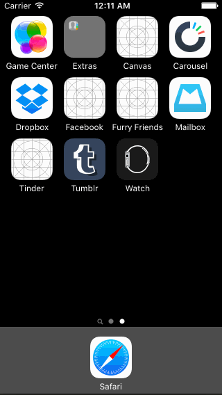

# Facebook Prototype

Homework for CodePath, [Week 5 Project: Facebook](http://courses.codepath.com/courses/ios_for_designers/unit/5#!assignment)

## Summary
* This project took about **8 hours** to complete, over 2 sessions.
* **All required** steps are complete. ([see requirements](#requirements))

## Demo

<!-- ## Main Storyboard -->
<!--  -->

## Project Requirements
- [x] Tapping on a photo in the news feed should expand the photo full screen.
- [x] Tapping the Done button should animate the photo back into its position in the news feed.
- [x] On scroll of the full screen photo, the background should start to become transparent, revealing the feed.
- [x] If the user scrolls a large amount and releases, the full screen photo should dismiss.
- [ ] Optional: The full screen photo should be zoomable.
- [ ] Optional: The user should be able to page through the other photos in full screen mode.
